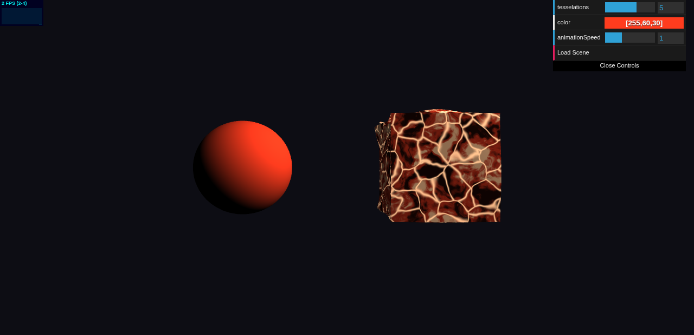

# HW 0: Intro to Javascript and WebGL

Zhuoyang Pan

Live demo: https://zhuoyang-pan.github.io/hw00-intro-base/



## What's here

A Lambert-shaded icosphere and a cube running a custom shader pair that makes it
look like a crust of cooled rock rippling over molten seams. Both objects share
the same GUI color, so the picker retints everything at once — red gives lava,
blue gives cracking ice. Drag to orbit, scroll to zoom.

**Cube** (`src/geometry/Cube.ts`) — inherits from `Drawable`. Faces don't share
vertices so each keeps a flat normal. Faces are also subdivided into a 32×32 grid;
with only the 8 corners the vertex displacement had nothing inside a face to move
and the ripple was invisible.

**Vertex shader** — displaces along the normal by `sin(x)*cos(y)*sin(z)`, each axis
on its own phase speed off `u_Time` so the waves drift out of sync. It also
rebuilds the normal by finite differences across a tangent basis, otherwise the
lighting keeps following the flat faces and the ripple only shows in the
silhouette.

**Fragment shader** — three layers of hand-written 3D noise:

- Perlin, using the surflet formulation
- FBM of that Perlin, then used to warp its own input domain, which is what
  stretches the round blobs into marbling
- Worley, where `F2 - F1` draws the cracks. Offset by the same warp field so the
  cracks wander with the marbling instead of sitting on a visible lattice

The cracks are emissive so they keep glowing on faces turned away from the light.
Both noise fields drift on `u_Time`, so the surface keeps moving even when the
geometry is still.

## Controls

- `tesselations` — icosphere subdivision level
- `color` — drives `u_Color` in both shaders
- `animationSpeed` — scales `u_Time`; 0 freezes it
- `Load Scene` — rebuilds geometry

## Running

```
npm install
npm run dev     # localhost:5660
npm run build
```

---

# Original assignment README

## Objective
- Check that the tools and build configuration we will be using for the class works.
- Start learning Typescript and WebGL2
- Practice implementing noise

## Assignment Details
1. Take some time to go through the existing codebase so you can get an understanding of syntax and how the code is architected.
2. Take a look at the resources linked in the section below.
3. Add a `Cube` class that inherits from `Drawable` and at the very least implement a constructor and its `create` function. Then, add a `Cube` instance to the scene to be rendered.
4. Read the documentation for dat.GUI below. Update the existing GUI in `main.ts` with a parameter to alter the color passed to `u_Color` in the Lambert shader.
5. Write a custom fragment shader that implements FBM, Worley Noise, or Perlin Noise based on 3D inputs (as opposed to the 2D inputs in the slides). This noise must be used to modify your fragment color.
6. Write a custom vertex shader that uses a trigonometric function (e.g. `sin`, `tan`) to non-uniformly modify your cube's vertex positions over time.
7. Feel free to update any of the files when writing your code.

## Resources
- Javascript modules https://developer.mozilla.org/en-US/docs/Web/JavaScript/Reference/Statements/import
- Typescript https://www.typescriptlang.org/docs/home.html
- dat.gui https://workshop.chromeexperiments.com/examples/gui/
- glMatrix http://glmatrix.net/docs/
- WebGL
  - Interfaces https://developer.mozilla.org/en-US/docs/Web/API/WebGL_API
  - Types https://developer.mozilla.org/en-US/docs/Web/API/WebGL_API/Types
  - Constants https://developer.mozilla.org/en-US/docs/Web/API/WebGL_API/Constants
